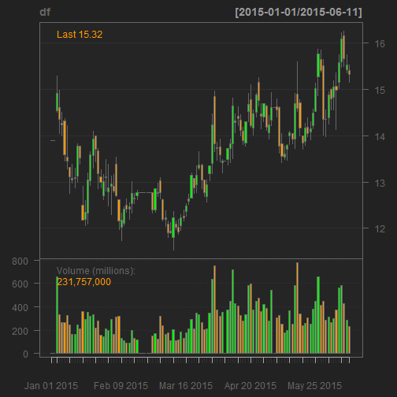

Stock CandleStick Plot App Presentation
========================================================
author: Li Gongzuo
date: 2015-6-12

What’s the app function?
========================================================

1.The Stock CandleStick Charts App was created by Gongzuo Li (https://github.com/LiGongzuo), in order to plot the CandleStick charts of a stock in the specified period.

2.The stocks can come from ShanghaiShanghai Stock Exchange (ss), Shenzhen Stock Exchange(ss), Hong Kong Stock Exchange (hk).

3.You can get the application @ https://ligongzuo.shinyapps.io/Stock_CandleStickPlot_App

4.You can get the R code @ https://github.com/LiGongzuo/Developing-Data-Product/tree/master/shiny_file

SidebarPanel inputs in ui.R:
========================================================

```r
textInput('stockcode', 'Input the Stock code: ',"000002"),
checkboxGroupInput("exchange", "Choose the Stock Exchange :",
                   c("Shanghai" = "ss",
                     "Shenzhen" = "sz",
                     "Hongkong"="hk"),
                   selected=c("sz")),
dateInput("from", "Choose the date from:",value = '2015-01-02'),
dateInput("to", "Choose the date to:"),

submitButton('Submit')
```
User choose the sctok and the period firstly and submit.

Output RenderPlot in Server.R:
========================================================

```r
# set symbol
setSymbolLookup(stock=list(
        name=paste(input$stockcode,input$exchange,
        sep="."),src='yahoo'))

# download the data
df <- getSymbols(Symbols = "stock",
                 from=input$from,
                 to=input$to,
                 env=environment(),
                 auto.assign=FALSE)
names(df)<-c("Open","High","Low","Close"
             ,"Volume","Adjusted")
# plot
chartSeries(df,TA = "addVo()")
```
Server download the data from yahoo, and plot the CandleStick charts.

Stock CandleStick charts example: 
========================================================

The code run in this slide the same as the app, and get this CandleStick charts:

 
